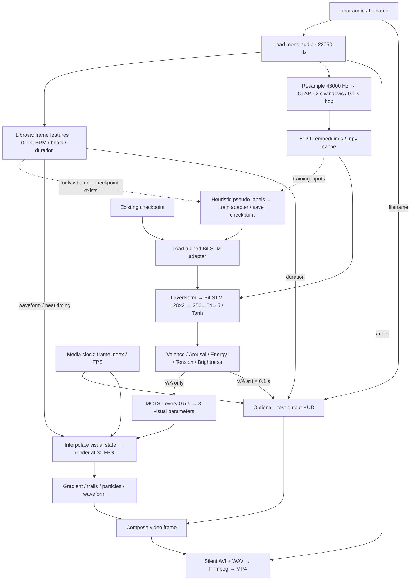

> 目录整理（2026-09-30）：这是正式 1.0 代码，保留原 Git 历史及整理前未提交修改。默认模型改为工作区 `models/emotion_model.pth`；默认视频与缓存分别位于 `data/v1.0/outputs` 和 `data/v1.0/cache`，不再写入音频旁。可用 `--output-dir` / `--cache-dir` 指定目录。当前使用说明见工作区根目录 `README.md`。下文同目录输出描述为旧行为。

# Music Visualization

A system that transforms audio into dynamic visual output based on emotion recognition and audio features.

---

## Installation

### 1.Rrepository

```bash
git clone https://github.com/YTYoytyooo/MusicVisualization.git
cd MusicVisualization
```

---

### 2. Requirements

```bash
pip install -r requirements.txt
```

---

## Dependencies

### FFmpeg (strongly recommended)

FFmpeg is used for audio decoding and final video encoding.

#### With FFmpeg (recommended)

The program outputs a final `.mp4` video.

Install:

* Windows: https://ffmpeg.org (add to PATH)
* macOS:

```bash
brew install ffmpeg
```

* Linux:

```bash
sudo apt install ffmpeg
```

---

#### Without FFmpeg (fallback mode)

If FFmpeg is not installed, the program will still run but outputs:

* `.avi` (video)
* `.mp3` (audio)

---

### Hugging Face (optional, but you need at least to be able to access this website if you are in China mainland)

This project uses a CLAP-based model from Hugging Face.

No login is required, but authentication improves speed and avoids rate limits.

Optional setup:

```bash
pip install huggingface_hub
hf auth login
```

Notes:

* Model downloads automatically on first run
* Authentication is optional but recommended

---

## Usage

### Basic usage

```bash
python main.py input1.mp3 input2.wav input3.flac
```

### Specify model file (optional)

```bash
python main.py input1.wav input2.mp3 --model emotion_model.pth
```

### Test videos: predicted V–A trajectory, song name and playback clock

```bash
python main.py "your-song.mp3" --test-output
python main.py "song-a.wav" "song-b.mp3" --model emotion_model.pth --test-output
```

Test outputs are named `your-song_test.mp4` alongside the input (with a numeric
suffix if necessary). Without `--test-output`, the existing clean video output
is unchanged. This option is separate from the legacy `renderer.TEST` particle
physics debug switch.

- Header: input filename without extension, plus audio playback time / duration
  in `mm:ss.mmm` (not wall-clock time).
- Right panel: a zoomed main plot with real-value ticks (horizontal valence /
  vertical arousal), plus a full −1…+1 inset with the zoom region outlined.
  Main-plot bounds are computed once from the complete offline prediction sequence
  and stay fixed during playback. Both axes use the same span, with 10% padding
  per side where possible and a minimum span of 0.1 (maximum 20x magnification).
  No predictions are normalized, amplified, or discarded. For cross-song
  comparisons, use the full-range inset and numeric values: zoom bounds may differ.
- Both plots show history only up to the current sample, highlight the last
  **2 seconds**, and mark the current position. Earlier history stays dim.
  This changes the V-A plot highlight, not the background particles' trail length.
- Synchronization: video time is `frame_index / fps`; prediction `i` is assigned
  `i * FRAME_DUR` by the existing pipeline. Hold the latest available prediction
  between samples; do not interpolate predictions or draw future trajectory points.
  The final prediction is held through any short audio remainder.
- These are model estimates, not human ground truth. Inference remains offline:
  CLAP uses 2-second windows, including audio after each window's starting timestamp.
  A synchronized display does not imply streaming/causal emotion recognition.
- Chinese filenames use a system CJK font (Microsoft YaHei on Windows). For other
  languages/systems, supply a font supporting the title:

```bash
python main.py "歌曲.mp3" --test-output --overlay-font "C:/Windows/Fonts/msyh.ttc"
```

Very long titles are truncated to fit the header; the source filename is unchanged.
The overlay adds no model downloads and does not change training, MCTS or audio.

Verification (no model download):

```bash
python -m unittest discover -s tests -v
python tests/preview_test_output.py --output-dir ../test-output-preview
```

The preview command uses a synthetic tone and synthetic V/A values solely to test
display, timing and encoding; it is not a music-emotion evaluation.

---

### Notes

* Multiple input files are supported
* Each input file generates a corresponding output video
* Output files are saved in the current directory
* Supported formats: `.mp3`, `.wav`, `.flac`

---

## Project Structure

```text
main.py                  # Entry point
feature_extraction.py    # Audio analysis
emotion_model.py         # Emotion prediction
mcts.py                  # Decision algorithm
renderer.py              # Visualization rendering
requirements.txt         # Dependencies
README.md                # Documentation
```

---

## How It Works



1. Audio is loaded and processed into features
2. CLAP-based model estimates emotional characteristics
3. MCTS determines visual transitions and states
4. Renderer generates frames based on emotion and structure
5. Frames are encoded into a video file

---

## License

MIT License
